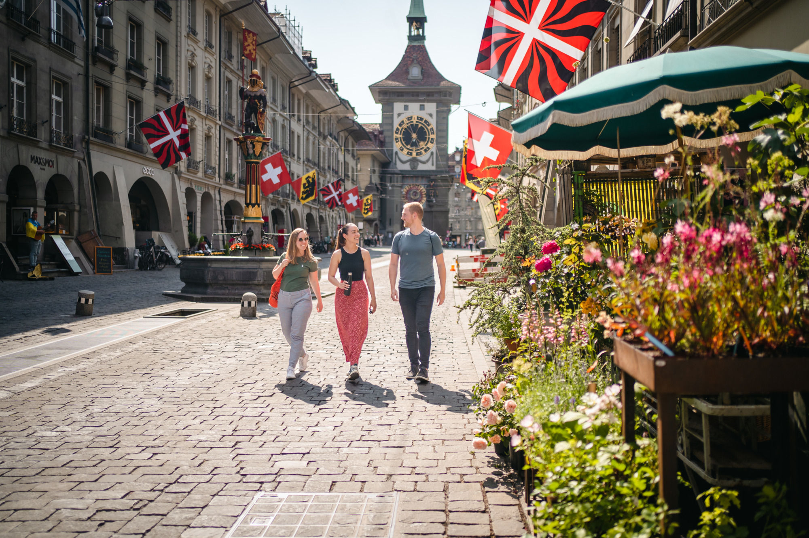

{fig-alt="The Zytglogge clock tower in Bern on a sunny summer day" width=100%}

For a holistic overview of hotels in Bern, please visit [bern.com's accommodation website](https://bern.com/en/inform/accommodations/).

## More for your money

If you are looking for "more-for-money" (i.e. cheaper) options, here is a list of possibilities:

- [Aparthotel Il Momento](https://bern.com/en/inform/accommodations/hotels/aparthotel-il-momento)
- [Los Lorentes Residences](https://bern.com/en/inform/accommodations/apartments-and-group-accommodations/los-lorentes-residences)
- [Jugendherberge Bern](https://bern.com/en/inform/accommodations/hostels/bern-youth-hostel)
- [Bern Backpackers Hotel Glocke](https://bern.com/en/inform/accommodations/hostels/bern-backpackers-hotel-glocke)
- [Hostel 77 Bern](https://bern.com/en/inform/accommodations/hotels/hostel-77-bern)
- [Stay KOOOK Bern Wankdorf](https://bern.com/en/inform/accommodations/hotels/stay-kooook-bern-wankdorf) & [Bern City](https://bern.com/en/inform/accommodations/hotels/stay-kooook-bern-city)
- [Ibis Budget Bern Expo](https://bern.com/en/inform/accommodations/hotels/hotel-ibis-budget-bern-expo)
- [Marthahaus Bern](https://bern.com/de/informieren/unterkuenfte/hotels/hotel-marthahaus-bern)

::: {.callout-important}
## Free public transport with the Bern-Ticket

From your first overnight stay at any accommodation within the city of Bern, you will receive the **Bern-Ticket**, giving you free travel on trams, buses, and trains in the Libero network zones 100/101 ([network map](https://www.mylibero.ch/sites/default/files/2025-12/Liniennetz-Bern-2026_0.pdf)) for the entire duration of your stay. Detailed information about the Bern-Ticket can be found [here](https://bern.com/en/inform/bern-ticket/bern-ticket-for-overnight-guests).
:::
